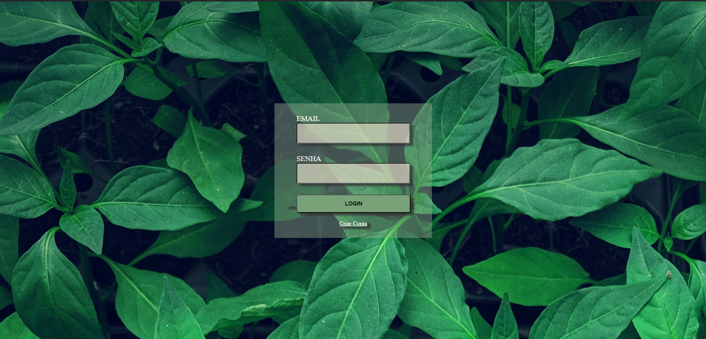
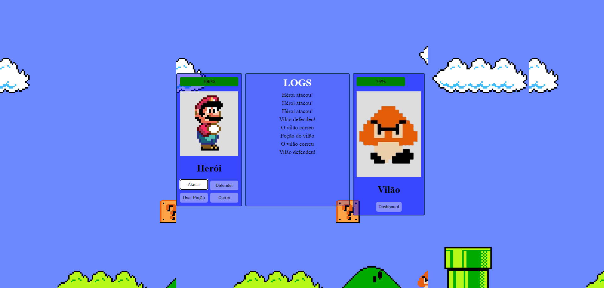
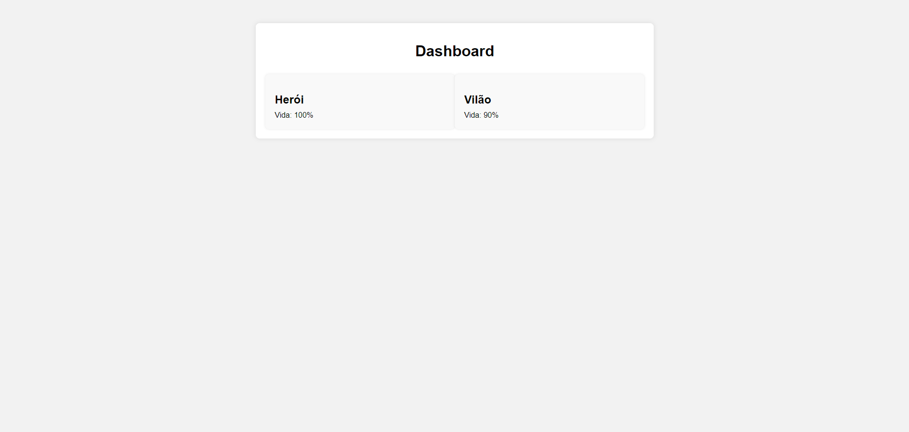

# Game Fullstack Heroi vs Vilão

# 🎮 Descrição
Esse Jogo foi desenvolvido nas matérias de banco de dados e web II usando Node + Express e Vue.js. O usuário pode interagir escolhendo ações para os personagens e a cada ação realizada, o log de cada ação é exibida na tela.

# 💻 Tecnologias Utilizadas 
- Frontend: Vue.js
- Backend: Node.js com Express
- Banco de Dados: Azure DB
- Hospedagem: Render (API)

# Links e acessos
- Acesso ao game: https://api-game-card-fullstack.onrender.com
- Banco que dados: https://portal.azure.com/
- Github: https://github.com/habbiner/game-card-fullstack

# Imagens do projeto
- Tela de login

- Tela do game

- Dashboard

# Personagens
- Mario

- Vilão

# Nota
- Obs: Banco de dados pode estar desativado na Azure por conta de cobranças relacionadas ao serviços de hospedagem.